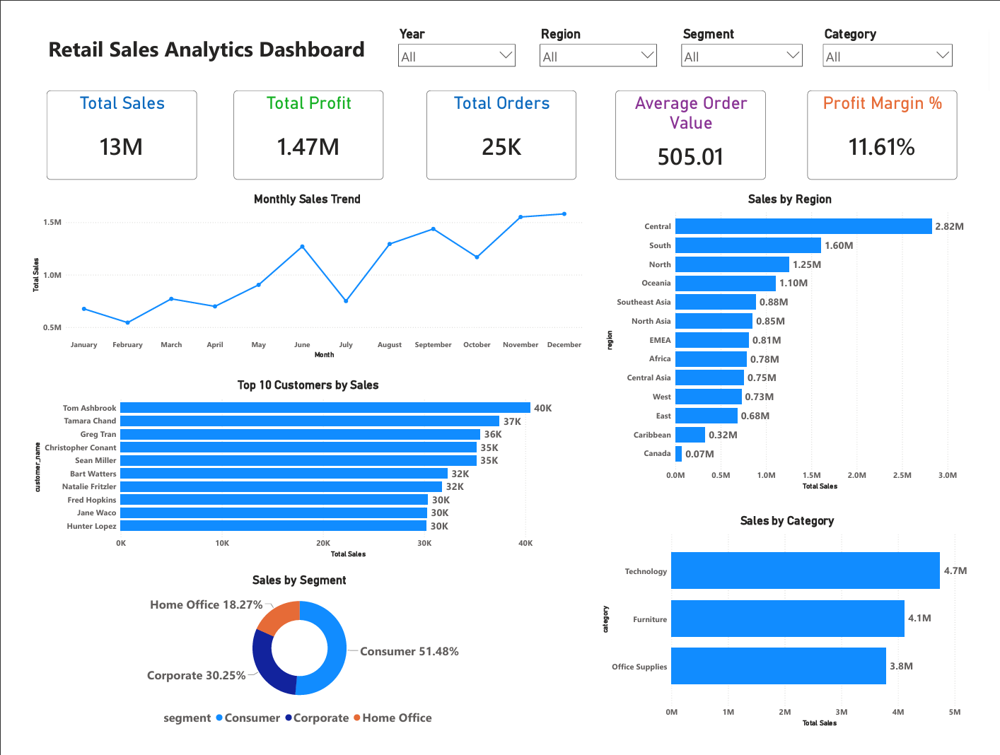
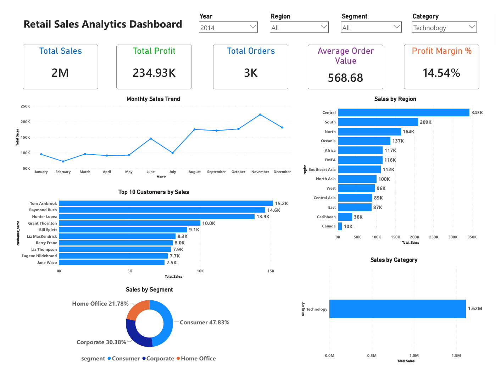

# 📊 Retail Sales Analytics Dashboard

An end-to-end **Data Analytics** project that analyzes retail sales data using **Python, SQL, and Power BI**. The project demonstrates data cleaning, data quality assessment, SQL analysis, business intelligence, KPI development, and interactive dashboard design to generate actionable business insights.

---

# 📷 Dashboard Preview

## 📊 Main Dashboard



## 📈 Filtered Dashboard



---

# 📌 Project Overview

The objective of this project is to analyze retail sales data and build an interactive Power BI dashboard that helps stakeholders monitor sales performance, profitability, customer behavior, and regional performance.

The project follows a complete Data Analytics workflow, from raw data preparation to business intelligence reporting.

---

# 🎯 Business Objective

The dashboard enables business users to:

- Monitor overall sales performance
- Track profitability across regions
- Analyze customer segments
- Identify top-performing customers
- Compare category-wise sales
- Make data-driven business decisions

---

# 🛠️ Tools & Technologies

- Power BI
- Power Query
- DAX
- Python
- Pandas
- SQL
- Microsoft Excel

---

# 💡 Skills Demonstrated

- Data Cleaning
- Data Quality Assessment
- Exploratory Data Analysis (EDA)
- SQL Querying
- Data Transformation
- KPI Development
- Data Visualization
- Dashboard Design
- Business Intelligence
- Business Analysis

---

# 📂 Dataset Information

**Dataset:** Global Superstore Dataset

The dataset contains retail transaction data, including:

- Orders
- Customers
- Products
- Sales
- Profit
- Categories
- Regions
- Order Dates
- Shipping Details

---

# 🔄 Project Workflow

1. Collected the retail sales dataset.
2. Performed data quality assessment using Python.
3. Cleaned and transformed the dataset.
4. Analyzed business metrics using SQL.
5. Built an interactive dashboard in Power BI.
6. Generated business insights through visualizations and KPIs.

---

# 📈 Key Performance Indicators (KPIs)

- Total Sales
- Total Profit
- Total Orders
- Average Order Value (AOV)
- Profit Margin %

---

# 📊 Dashboard Features

- Interactive KPI Cards
- Monthly Sales Trend
- Sales by Region
- Sales by Category
- Sales by Segment
- Top 10 Customers by Sales
- Interactive Slicers
  - Year
  - Region
  - Segment
  - Category

---

# 🔍 Key Business Insights

- Technology products generated the highest sales.
- The Consumer segment contributed the largest share of revenue.
- Sales demonstrated an overall positive growth trend.
- A small group of customers contributed significantly to total sales.
- Regional performance varied across different markets.

---

# 📁 Project Structure

```text
Project-1-Retail-Sales/
│
├── Dataset/
├── Python/
├── SQL/
├── PowerBI/
├── Documentation/
├── Images/
└── README.md
```

---

# 📚 Repository Contents

## 📂 Dataset

- Raw Dataset
- Cleaned Dataset

## 🐍 Python

- Data Quality Assessment Notebook
- Data Cleaning

## 🗄️ SQL

- Basic Business Queries
- Intermediate Business Queries
- Advanced Business Queries
- KPI Queries

## 📊 Power BI

- Interactive Dashboard (.pbix)

## 📄 Documentation

- Dashboard PDF
- Project Presentation

---

# 🚀 Future Improvements

- Add Drill-through Reports
- Publish Dashboard to Power BI Service
- Add Forecasting Visuals
- Add Dynamic Tooltips
- Build Additional KPI Pages

---

# 👤 Author

**Kanimozhi S M**

Aspiring Data Analyst

### Technical Skills

- SQL
- Python
- Pandas
- Power BI
- Power Query
- DAX
- Microsoft Excel
- Data Cleaning
- Data Visualization
- Business Intelligence

---

⭐ If you found this project helpful, consider giving it a star.
